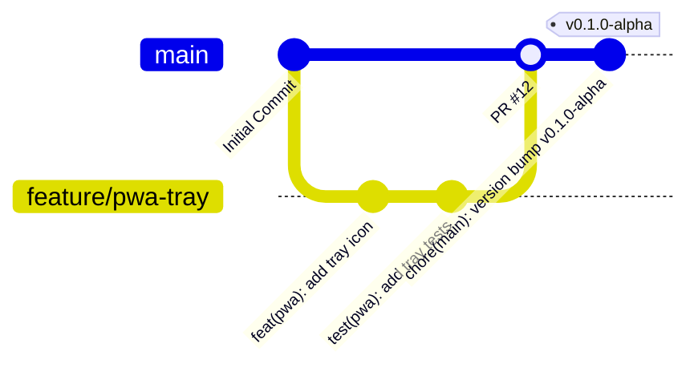

# Contributing to AI Workspace Gateway

Thank you for your interest in contributing to **AI Workspace Gateway**! We welcome and appreciate contributions from the community.

Before you begin, please read our [CODE_OF_CONDUCT.md](file:///Users/venki/Desktop/AI%20Workspace%20Gateway/CODE_OF_CONDUCT.md) to ensure a welcoming environment.

---

## 🪵 Development Workflow

We use a Monorepo structure managed by `pnpm`.

### 1. Prerequisites
*   Node.js (v20+ LTS)
*   pnpm (v9+)
*   Git

### 2. Local Setup
```bash
# Clone the repository
git clone https://github.com/your-username/ai-workspace-gateway.git
cd ai-workspace-gateway

# Install dependencies across all packages
pnpm install

# Start all workspaces in watch/development mode
pnpm dev
```

---

## 🌿 Branch Strategy

We follow a **Trunk-Based Development** model with short-lived feature branches and release tags.



*   **Protected Branch**: `main` is protected. Code cannot be pushed directly to `main`.
*   **Feature Branches**: Prefix branch names:
    *   `feature/` or `feat/` for new capabilities (e.g., `feature/pwa-tray-menu`).
    *   `bugfix/` or `fix/` for resolving issues.
    *   `docs/` for writing documentation.
    *   `chore/` for dependency updates or build tooling.
*   **Pull Requests**: All code changes must submit a PR to `main` and receive at least one approved code review.

---

## 🏷️ Versioning Strategy

This project strictly adheres to **Semantic Versioning 2.0.0** (SemVer):
*   **MAJOR** version: incompatible API changes (e.g., database schema breaking changes without auto-migration).
*   **MINOR** version: add functionality in a backwards-compatible manner (e.g., adding a new AI provider adapter).
*   **PATCH** version: backwards-compatible bug fixes.

---

## 🚀 Release Strategy

1.  **Draft Releases**: On merges to `main` that contain a version bump, a GitHub Actions workflow automatically compiles client assets and drafts a release notes page.
2.  **Tag Releases**: Release candidates are created by tagging commits (`vX.Y.Z`).
3.  **Client Distribution**:
    *   **PWA**: Deployed automatically to hosting services on tag release.
    *   **Telegram Bot / Gateway**: Docker containers are compiled and published to GitHub Container Registry.
    *   **Desktop Wrappers**: Installers for macOS (`.dmg`/`.pkg`) and Windows (`.msi`) are compiled via CI runner actions and attached directly to the GitHub Release.

---

## 📝 Commit Conventions

We enforce the **Conventional Commits 1.0.0** format for all commit messages. This allows automatic changelog generation.

### Format
```text
<type>(<scope>): <description>

[optional body]

[optional footer(s)]
```

### Allowed Types (`<type>`)
*   `feat`: A new feature (corresponds to a MINOR version bump).
*   `fix`: A bug fix (corresponds to a PATCH version bump).
*   `docs`: Documentation only changes.
*   `style`: Changes that do not affect the meaning of the code (white-space, formatting, missing semi-colons, etc.).
*   `refactor`: A code change that neither fixes a bug nor adds a feature.
*   `perf`: A code change that improves performance.
*   `test`: Adding missing tests or correcting existing tests.
*   `build`: Changes that affect the build system or external dependencies.
*   `ci`: Changes to CI configuration files and scripts.
*   `chore`: Regular maintenance tasks.

### Examples
*   `feat(providers): add Google Gemini adapter`
*   `fix(database): prevent connection timeout on startup`
*   `docs(readme): fix typos in quickstart commands`

---

## 🤝 Code Review Process

1.  Create a detailed Pull Request using the [PULL_REQUEST_TEMPLATE.md](file:///Users/venki/Desktop/AI%20Workspace%20Gateway/.github/PULL_REQUEST_TEMPLATE.md).
2.  Ensure CI checks (linting, typescript validation, unit tests) pass.
3.  Address comments and feedback from reviewers.
4.  Once approved, squash and merge into `main`.
