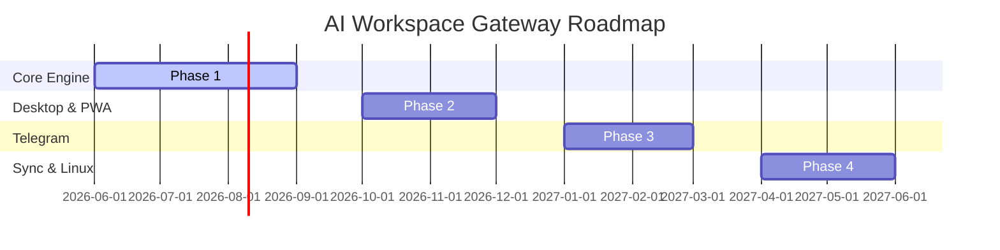

# Project Roadmap

This document outlines the milestones, phases, and release targets for the **AI Workspace Gateway**.

---

## 🗺️ High-Level Release Timeline

---

## 🛠️ Detailed Phase Plan

### Phase 1: Core Engine & Local Database (v0.1.0-alpha)
*Focus: Establish the provider-agnostic abstractions and secure local storage foundation.*

*   [ ] **`packages/core`**:
    *   State machine for chats, agent memories, and session contexts.
    *   Dynamic streaming router capable of swapping API clients on a per-turn basis.
    *   Core system tool registration interface (local executor, web retriever).
*   [ ] **`packages/storage`**:
    *   SQLCipher / SQLite WASM adapter with schema migration system.
    *   Secure Master Password derivation library (PBKDF2/Argon2).
*   [ ] **`providers/`**:
    *   Integrations for **Gemini**, **Ollama**, **Anthropic**, and **OpenAI**.
    *   System command translation interface for LLM function calling formats.

---

### Phase 2: Progressive Web App & OS Integrations (v0.2.0-beta)
*Focus: Bring the workspace to the desktop as a high-fidelity client.*

*   [ ] **`apps/pwa`**:
    *   Responsive, low-latency UI built with design tokens from `packages/common` and `assets/`.
    *   Service Worker setups for full offline operations.
    *   System tray interface and global keyboard shortcuts implementation.
*   [ ] **Native OS Wrappers**:
    *   **macOS Desktop Shell**: Custom menubar menu, Keychain API access, and Apple Silicon optimization indicators.
    *   **Windows Desktop Shell**: Taskbar system-tray menu, Windows Credential Manager mapping, and desktop toast alerts.
*   [ ] **Workspace Features**:
    *   Multi-workspace view, custom system prompt manager, and prompt history indexing.
    *   Basic local RAG (Vector embeddings using client-side WASM models).

---

### Phase 3: Telegram Client Ecosystem (v0.3.0)
*Focus: Deep integration with the Telegram mobile and desktop ecosystem.*

*   [ ] **`apps/telegram`**:
    *   Telegram Bot gateway server that relays queries directly to the user's running local core (secure socket/tunnel connection).
    *   Markdown parser for message formats, handling complex code blocks and tables in bot outputs.
*   [ ] **Telegram Mini App (TMA)**:
    *   High-fidelity mobile dashboard mirroring the PWA workspace settings.
    *   Biometric lock integration (Telegram App Biometrics API) matching local master password requirements.

---

### Phase 4: Peer-to-Peer Sync & Linux Client (v0.4.0 & Beyond)
*Focus: Decentralized syncing and full Linux desktop support.*

*   [ ] **Decentralized Sync**:
    *   WebRTC-based signaling server configurations for direct client-to-client workspace synchronization.
    *   CRDT-based merging logic for local chat histories and configurations.
*   [ ] **Linux Client**:
    *   Full compatibility tests on major distributions (Ubuntu, Fedora, Arch).
    *   Packaging configurations for AppImage and Flatpak distributions.
    *   Standard D-Bus notification system bindings.
