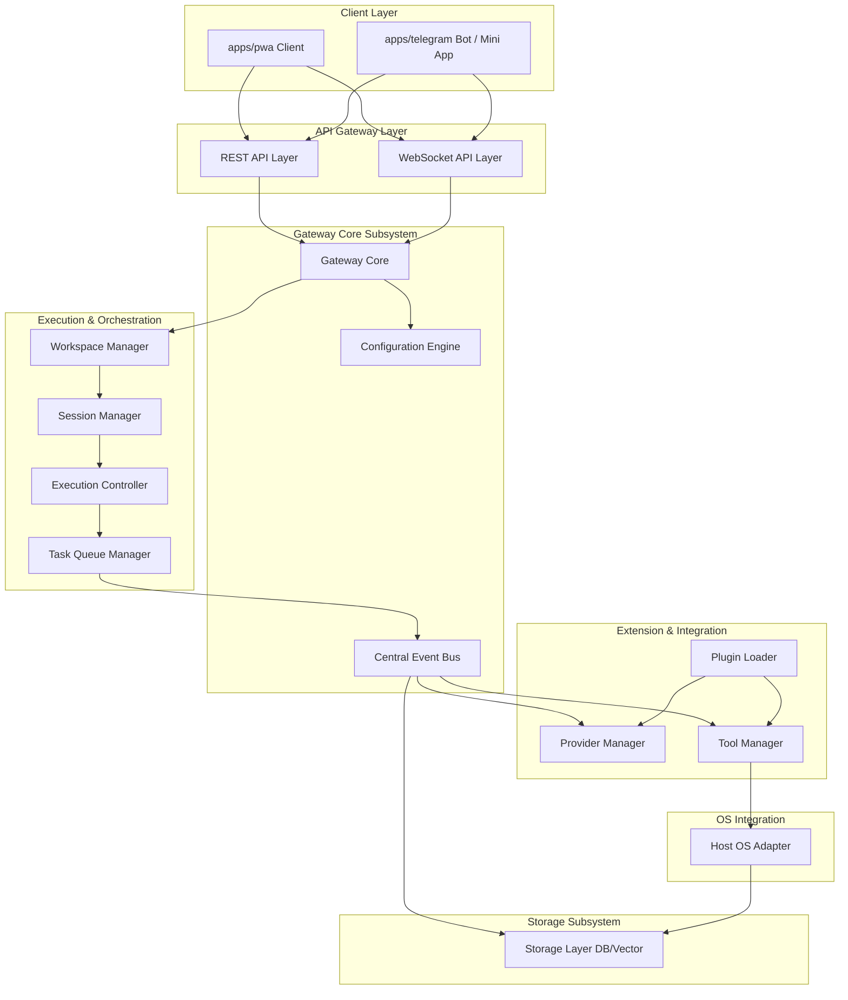
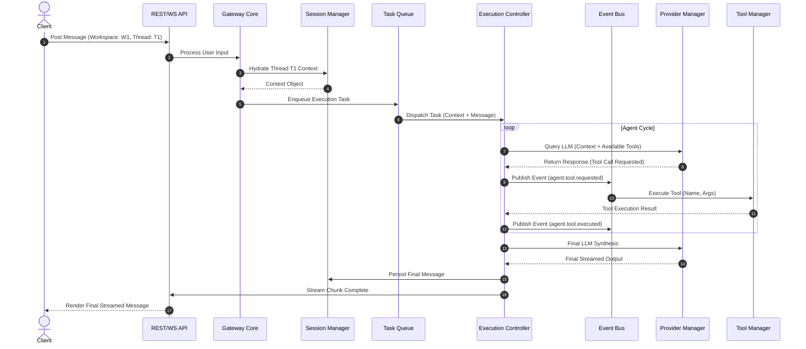
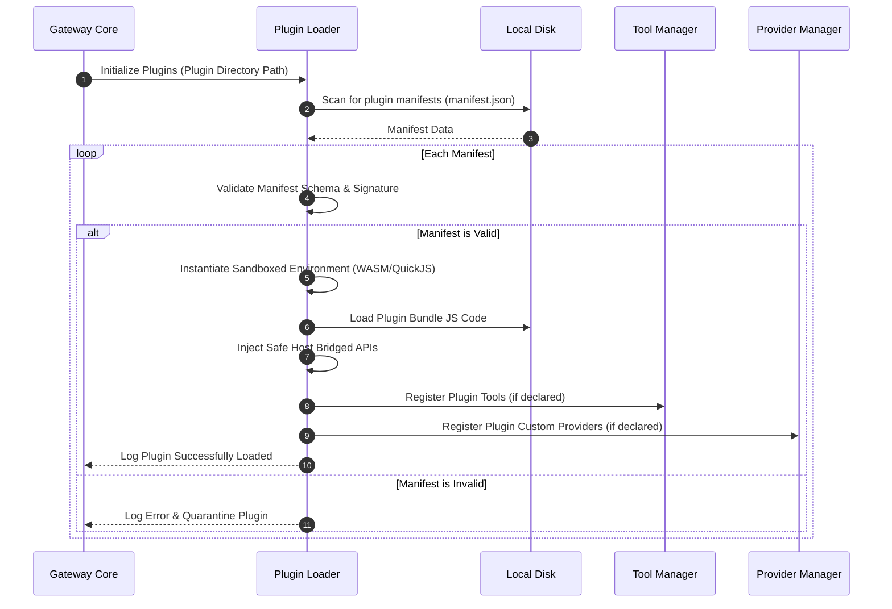

# Software Architecture Specification

This document details the software architecture of the **AI Workspace Gateway**. The system is built to act as a local agentic runtime, interfacing client targets with heterogeneous local and cloud-based AI providers.

---

## 🎯 Architectural Philosophy & Constraints

To ensure data ownership, flexibility, and extensibility, the architecture is bound to the following constraints:

1.  **Local-First**: The primary runtime, session databases, and configuration engines reside on the host system. Central servers must not act as gateway intermediaries or log storage.
2.  **Plugin-Based**: Core capabilities (e.g., custom tools, data parsers, specialized providers) must be dynamically loaded and sandboxed at runtime without modifications to the gateway core.
3.  **Event-Driven**: Internal operations (agent steps, database updates, UI telemetry) execute asynchronously using a centralized Event Bus to decouple modules.
4.  **Provider-Agnostic**: All interface operations are translation-mapped. Swapping from a commercial API to a local model occurs without rebuilding message contexts.
5.  **Client-Agnostic**: The core gateway exposes standard interfaces (REST/WebSocket), allowing identical engine behaviors for the Progressive Web App (PWA), Telegram Bot, or future clients.

---

## 🏗️ System Component Diagram

The following diagram maps the structural relationships between the primary subsystems of the AI Workspace Gateway:

---

## 🧩 Core Module Breakdowns

### 1. Gateway Core
*   **Purpose**: Act as the single initialization runtime and lifecycle orchestrator.
*   **Responsibilities**:
    *   Initialize and teardown sub-modules (Event Bus, Workspace Manager, Plugin Loader).
    *   Expose bootstrap lifecycle hooks (`onInit`, `onReady`, `onShutdown`).
    *   Monitor runtime heartbeats and handle system shutdowns gracefully.

### 2. Workspace Manager
*   **Purpose**: Enforce logical and physical isolation boundaries between contexts.
*   **Responsibilities**:
    *   Create, list, and delete workspace boundary configurations.
    *   Manage isolation profiles (e.g., ensuring Workspace A's plugin instances or local file system access cannot leak into Workspace B).
    *   Mount workspace-specific file locations and vector index targets.

### 3. Execution Controller
*   **Purpose**: Manage the agentic execution cycle and LLM query loops.
*   **Responsibilities**:
    *   Synthesize prompt templates, system instructions, and injection vectors.
    *   Execute the **Reasoning-Action loop** (polling LLMs, identifying tool calls, invoking tool execution, appending results, re-submitting to LLM).
    *   Enforce context window budgeting (truncating conversation history dynamically).

### 4. Task Queue
*   **Purpose**: Queue and process resource-intensive workloads sequentially.
*   **Responsibilities**:
    *   Order agent execution turns and RAG document ingestion processes.
    *   Manage concurrency limits (preventing local compute resource exhaustion).
    *   Maintain retry budgets, backoff intervals, and execution logs.

### 5. Session Manager
*   **Purpose**: Manage chat threads, token state caches, and execution histories.
*   **Responsibilities**:
    *   Hydrate active threads from storage into active runtime memory.
    *   Buffer stream tokens to avoid continuous write stress on the storage database.
    *   Index sessions for full-text search capability.

### 6. Event Bus
*   **Purpose**: Provide an asynchronous, typed pub/sub event channel.
*   **Responsibilities**:
    *   Route events like `session.message.received`, `agent.tool.executed`, and `system.resource.critical`.
    *   Support both local in-process event listeners and remote WebSocket streams.
    *   Implement wildcards and topic filters.

### 7. Plugin Loader
*   **Purpose**: Dynamically load, validate, and isolate third-party extensions.
*   **Responsibilities**:
    *   Read and validate plugin metadata manifest packages.
    *   Instantiate plugins within isolated execution sandboxes (e.g., QuickJS WebAssembly runtimes) to prevent memory leaks or arbitrary OS system calls.
    *   Regulate access permissions to Host Adapters and storage folders.

### 8. Provider Manager
*   **Purpose**: Standardize interactions with LLM models.
*   **Responsibilities**:
    *   Route prompt requests to local runtimes (Ollama/Llama.cpp) or remote REST APIs (Gemini, OpenAI).
    *   Standardize responses (streaming tokens, structured JSON outputs, usage metrics) into a unified format.
    *   Track provider latency and availability.

### 9. Tool Manager
*   **Purpose**: Maintain the registry of executable functions available to agents.
*   **Responsibilities**:
    *   Validate tool schemas matching LLM function-calling requirements (e.g., JSON schema validation).
    *   Dispatch arguments to active tools and catch runtime errors.
    *   Enforce security access rules (e.g., prompt user before running file write tools).

### 10. Host Adapter
*   **Purpose**: Abstract host operating system API interfaces.
*   **Responsibilities**:
    *   Interface with macOS Keychain / Windows Credential Manager.
    *   Expose local directory watching and file read/write bridges.
    *   Trigger system notification windows and register system tray menus.

---

## 🔄 Interaction Sequence Diagrams

### 1. Message Execution Loop (Event-Driven)
The sequence below illustrates a client posting a message, routing it through the Task Queue, triggering the Execution Controller, invoking a local tool, and streaming the response.

### 2. Plugin Initialization Lifecycle
This sequence illustrates how plugins are loaded, validated, and sandboxed by the Plugin Loader.

