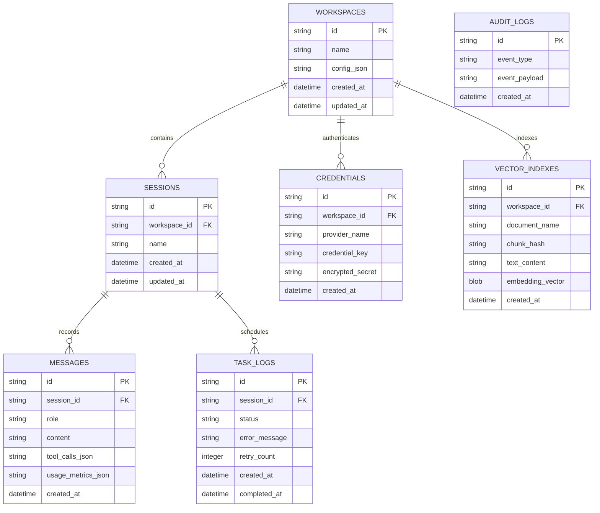

# Database Schema Specification

This document details the local relational storage schema, index configurations, entity relationships, and schema migration strategies of the **AI Workspace Gateway**.

---

## 📊 Entity-Relationship (ER) Diagram

The following diagram maps the structural linkages of tables within the local workspace storage file:

---

## 📑 Database Table Definitions

### 1. `workspaces`
Hosts isolated project environments containing workspaces definitions.

| Column | Type | Constraints | Description |
| :--- | :--- | :--- | :--- |
| **id** | VARCHAR(36) | PRIMARY KEY, NOT NULL | UUIDv4 identifier. |
| **name** | VARCHAR(255) | NOT NULL | User-defined label. |
| **config_json** | TEXT | NOT NULL | JSON string of configuration overrides. |
| **created_at** | DATETIME | DEFAULT CURRENT_TIMESTAMP | Record creation timestamp. |
| **updated_at** | DATETIME | DEFAULT CURRENT_TIMESTAMP | Last modified timestamp. |

*   **Indexes**: Unique index on `name`.

---

### 2. `sessions`
Represents chat threads within a workspace context.

| Column | Type | Constraints | Description |
| :--- | :--- | :--- | :--- |
| **id** | VARCHAR(36) | PRIMARY KEY, NOT NULL | UUIDv4 identifier. |
| **workspace_id** | VARCHAR(36) | FOREIGN KEY, NOT NULL | References `workspaces(id)` on delete cascade. |
| **name** | VARCHAR(255) | NOT NULL | Dynamic or user-defined thread title. |
| **created_at** | DATETIME | DEFAULT CURRENT_TIMESTAMP | Timestamp session started. |
| **updated_at** | DATETIME | DEFAULT CURRENT_TIMESTAMP | Last interaction timestamp. |

*   **Indexes**: Index on `workspace_id`, index on `updated_at`.

---

### 3. `messages`
Individual message records in a conversation thread.

| Column | Type | Constraints | Description |
| :--- | :--- | :--- | :--- |
| **id** | VARCHAR(36) | PRIMARY KEY, NOT NULL | UUIDv4 identifier. |
| **session_id** | VARCHAR(36) | FOREIGN KEY, NOT NULL | References `sessions(id)` on delete cascade. |
| **role** | VARCHAR(50) | CHECK (role IN ('system', 'user', 'assistant', 'tool')) | Author role. |
| **content** | TEXT | NOT NULL | Core payload content (plain text, markdown, tool outputs). |
| **tool_calls_json**| TEXT | NULL | JSON array containing model tool execution schemas. |
| **usage_metrics_json**| TEXT | NULL | Token usage metadata (input, output, cache hits). |
| **created_at** | DATETIME | DEFAULT CURRENT_TIMESTAMP | Message write timestamp. |

*   **Indexes**: Index on `session_id`, composite index on `(session_id, created_at)`.

---

### 4. `credentials`
Encrypted references to provider keys, bound to specific workspaces.

| Column | Type | Constraints | Description |
| :--- | :--- | :--- | :--- |
| **id** | VARCHAR(36) | PRIMARY KEY, NOT NULL | UUIDv4 identifier. |
| **workspace_id** | VARCHAR(36) | FOREIGN KEY, NOT NULL | References `workspaces(id)` on delete cascade. |
| **provider_name** | VARCHAR(100) | NOT NULL | Target AI provider (e.g., `gemini`, `openai`). |
| **credential_key** | VARCHAR(255) | NOT NULL | Key identifier or key type indicator. |
| **encrypted_secret**| TEXT | NOT NULL | AES-256-GCM cipher payload including initialization vector. |
| **created_at** | DATETIME | DEFAULT CURRENT_TIMESTAMP | Registration timestamp. |

*   **Indexes**: Unique index on `(workspace_id, provider_name, credential_key)`.

---

### 5. `vector_indexes`
Local semantic document fragments used for local RAG searches.

| Column | Type | Constraints | Description |
| :--- | :--- | :--- | :--- |
| **id** | VARCHAR(36) | PRIMARY KEY, NOT NULL | UUIDv4 identifier. |
| **workspace_id** | VARCHAR(36) | FOREIGN KEY, NOT NULL | References `workspaces(id)` on delete cascade. |
| **document_name** | VARCHAR(255) | NOT NULL | Origin file name. |
| **chunk_hash** | VARCHAR(64) | NOT NULL | SHA-256 of text block content to verify edits. |
| **text_content** | TEXT | NOT NULL | Parsed plain text slice. |
| **embedding_vector**| BLOB | NOT NULL | Float32 binary array of vectorized dimensions. |
| **created_at** | DATETIME | DEFAULT CURRENT_TIMESTAMP | Ingestion timestamp. |

*   **Indexes**: Index on `workspace_id`, index on `chunk_hash`.

---

### 6. `task_logs`
Execution queues and tracking logs of background workloads.

| Column | Type | Constraints | Description |
| :--- | :--- | :--- | :--- |
| **id** | VARCHAR(36) | PRIMARY KEY, NOT NULL | UUIDv4 identifier. |
| **session_id** | VARCHAR(36) | FOREIGN KEY, NOT NULL | References `sessions(id)` on delete cascade. |
| **status** | VARCHAR(50) | CHECK (status IN ('enqueued', 'executing', 'succeeded', 'failed', 'poisoned')) | Operational status. |
| **error_message** | TEXT | NULL | Crash trace if status is failed. |
| **retry_count** | INTEGER | DEFAULT 0 | Count of retries executed. |
| **created_at** | DATETIME | DEFAULT CURRENT_TIMESTAMP | Queue initialization time. |
| **completed_at** | DATETIME | NULL | Process end timestamp. |

*   **Indexes**: Index on `status`, Index on `session_id`.

---

### 7. `audit_logs`
Chronological file of security modifications.

| Column | Type | Constraints | Description |
| :--- | :--- | :--- | :--- |
| **id** | VARCHAR(36) | PRIMARY KEY, NOT NULL | UUIDv4 identifier. |
| **event_type** | VARCHAR(100) | NOT NULL | Action log (e.g., `key.created`, `db.unlocked`). |
| **event_payload** | TEXT | NOT NULL | Anonymized action details. |
| **created_at** | DATETIME | DEFAULT CURRENT_TIMESTAMP | Log capture timestamp. |

---

## 🔄 Data Migration & Versioning Strategy

To guarantee zero-data-loss upgrades of local client databases during open-source updates:

1.  **Schema Versioning**:
    *   The database runtime tracks versions using a metadata table named `schema_migrations` containing `version` (INT, SemVer format map), and `applied_at` (DATETIME).
2.  **Migration Pipeline (WASM / Native)**:
    *   On Gateway start, the Storage Layer compares the current database schema version against the target runtime code schema version.
    *   If current version $<$ target version, the schema runner applies step-by-step SQL migrations (e.g., `v1_to_v2.sql`) in a single isolation transaction.
3.  **Rollback Protection**:
    *   Before applying any migration script, the adapter creates a binary backup duplicate of the local database file (`db_backup_v[N].db`).
    *   If a migration throws an exception, the runner halts, logs the trace to `stderr`, restores the backup database file, and prompts the user to prevent data corruption.
