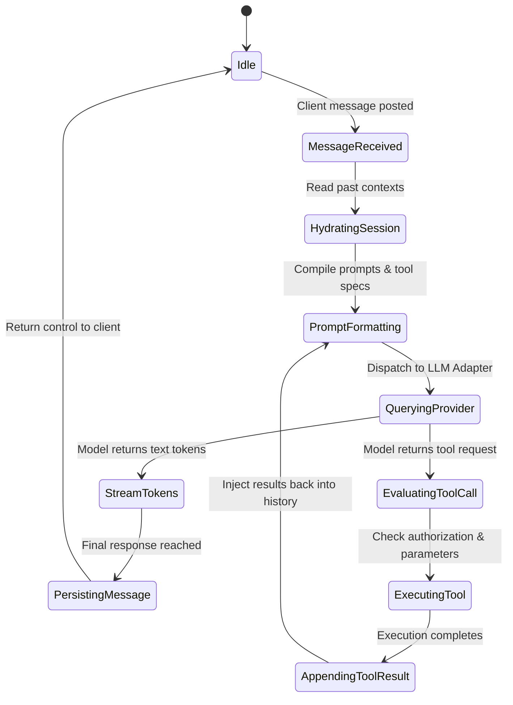
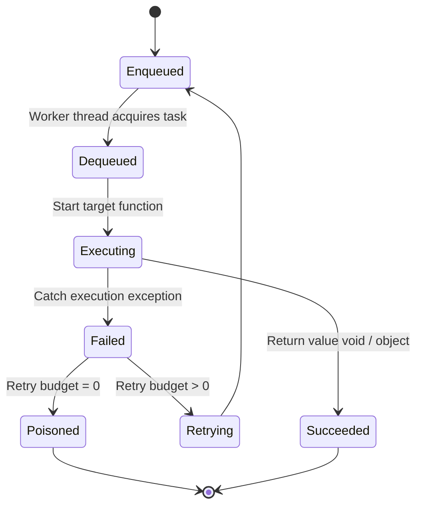
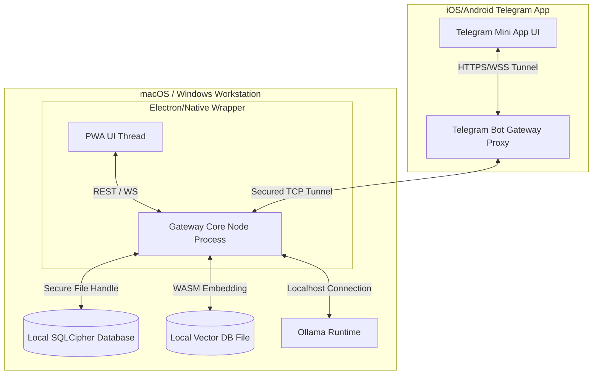

# System Design Specification

This document details the interface schemas, network protocols, execution lifecycles, configuration structures, and deployment topologies of the **AI Workspace Gateway**.

---

## 🌐 Communication Interfaces

The Gateway exposes two local API interfaces: a REST Layer for CRUD operations and session controls, and a WebSocket Layer for real-time, low-latency streaming agent execution events.

### 1. REST API Layer
All endpoints require a request header verifying client authorization:
`Authorization: Bearer <local_token>`

#### Key API Endpoints Reference

| Method | Path | Request Body Schema | Response Body Schema | Description |
| :--- | :--- | :--- | :--- | :--- |
| **GET** | `/api/v1/workspaces` | None | `{"workspaces": [Workspace]}` | List all isolated workspace contexts. |
| **POST**| `/api/v1/workspaces` | `{"name": string, "config": object}` | `{"workspace": Workspace}` | Create a new isolated workspace context. |
| **GET** | `/api/v1/sessions` | None | `{"sessions": [SessionSummary]}` | List chat sessions matching filters. |
| **POST**| `/api/v1/sessions` | `{"workspaceId": string, "name": string}`| `{"session": Session}` | Create a chat session in a workspace. |
| **GET** | `/api/v1/sessions/:id`| None | `{"session": Session, "messages": [Msg]}` | Retrieve full message thread history. |
| **POST**| `/api/v1/sessions/:id/messages` | `{"content": string, "role": "user"}` | `{"message": Msg, "taskId": string}` | Post a message and queue an execution task. |
| **GET** | `/api/v1/health` | None | `{"status": "ok", "usage": object}` | Retrieve system memory, database metrics. |

---

### 2. WebSocket Layer
Used for streaming token responses, tool execution stages, and monitoring log updates.

#### Real-time Message Frame Schema
Every payload conforms to this JSON structure:
```json
{
  "event": "string",
  "sessionId": "string",
  "taskId": "string",
  "timestamp": "ISO-8601-string",
  "payload": {}
}
```

#### Protocol Sequence & Heartbeats
*   **Establishment**: Connection is verified by query parameter `/ws?token=<local_token>`.
*   **Heartbeat Frequency**: 15 seconds. If the client misses three intervals, connection is dropped.
*   **Event Types Reference**:
    *   `connection.acknowledged`: Broadcasted immediately on connection validation.
    *   `session.token.stream`: Emits token chunks. `payload: {"token": "hello"}`.
    *   `session.tool.state`: Emits tool states. `payload: {"tool": "filesystem", "status": "running"}`.
    *   `session.task.completed`: Fired when the Execution Controller loop finishes.

---

## ⚙️ Configuration Schema

The gateway reads its environment from a root configuration file: `gateway.config.json`.

```json
{
  "$schema": "http://json-schema.org/draft-07/schema#",
  "title": "GatewayConfig",
  "type": "OBJECT",
  "properties": {
    "server": {
      "type": "OBJECT",
      "properties": {
        "host": { "type": "STRING", "default": "127.0.0.1" },
        "port": { "type": "INTEGER", "default": 8080 },
        "corsOrigins": { "type": "ARRAY", "items": { "type": "STRING" } }
      },
      "required": ["host", "port"]
    },
    "storage": {
      "type": "OBJECT",
      "properties": {
        "dataDir": { "type": "STRING", "default": "./.gateway/data" },
        "encryptionEnabled": { "type": "BOOLEAN", "default": true }
      },
      "required": ["dataDir", "encryptionEnabled"]
    },
    "providers": {
      "type": "OBJECT",
      "properties": {
        "active": { "type": "ARRAY", "items": { "type": "STRING" } },
        "ollama": {
          "type": "OBJECT",
          "properties": {
            "endpoint": { "type": "STRING", "default": "http://localhost:11434" }
          }
        }
      },
      "required": ["active"]
    }
  },
  "required": ["server", "storage", "providers"]
}
```

---

## 🔄 State Machine Diagrams

### 1. Agent Loop Lifecycle (Execution Controller)
The state transitions of the Execution Controller during a single prompt routing:



### 2. Task Queue States
The lifecycle of a single background task managed by the Queue Manager:



---

## 🎛️ Health Monitoring & Telemetry

### 1. Health Monitoring Checks
The `Health Monitoring` engine runs on a 30-second cron cycle inside the Gateway Core:
*   **Memory Metric Monitoring**: Check OS Resident Set Size (RSS). If memory footprint exceeds 1.5 GB on the host system, the monitor publishes a `system.resource.critical` event and halts vector index ingestion tasks.
*   **Database Health**: Perform quick integrity checks on SQLite database files.
*   **Provider Status**: Query local endpoint `/api/tags` (for Ollama) to monitor local model availability status.

### 2. Privacy-Preserving Telemetry
To respect user privacy while preserving software debugging metrics, the telemetry collector uses a strictly anonymized profile:
*   **No Payload Logging**: Conversation content, file paths, tool arguments, and IP addresses are completely stripped before telemetry triggers.
*   **Collected Metrics**:
    *   `session.started`: Count of chat sessions created.
    *   `provider.invocation.latency`: Duration in milliseconds taken by model endpoints.
    *   `error.code`: System execution code (e.g., `SQLITE_FULL`, `LLM_TIMEOUT`).
*   **Anonymization Envelope**: Telemetry updates are packaged with a salt-hashed client ID (derived from the database initialization key) to prevent cross-device tracking.

---

## 🏗️ Deployment Topologies

The following diagram maps the logical node mappings of the system across Local Desktop setups and mobile Telegram interfaces:


