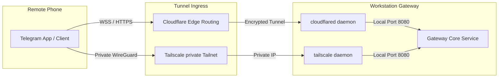

# Host Deployment & Installer Specification

This document details the release, packaging, automatic startup execution, and secure remote tunneling configurations for the **AI Workspace Gateway**.

---

## 📦 Host Installer Specifications

### 1. macOS Deployment (.dmg / .pkg)
*   **Packaging Structure**: The core runtime and PWA Electron wrapper are packaged into an App Bundle (`AI Workspace Gateway.app`).
*   **Compilation & Codesigning**:
    *   Build runs on macOS GitHub runner instances.
    *   Binaries must be signed with an active Apple Developer ID Application certificate.
    *   Must undergo automated Apple Notarization (`xcrun notarytool`) to prevent Gatekeeper warnings on end-user machines.

### 2. Windows Deployment (.msi)
*   **Packaging Structure**: Built using the WiX Toolset to compile a standard Windows Installer (`.msi`).
*   **Compilation & Codesigning**:
    *   Signed using a Microsoft-trusted Code Signing Certificate (EV preferred) via `signtool.exe`.
    *   Dependencies (Node binary, SQLite DLLs) are packaged into the installer CAB cabinet files.

---

## 🔄 Automatic Startup Specifications

To operate as a local gateway, the application runtime can be configured to start on user login.

### 1. macOS LaunchAgent Configuration
The installer registers a user agent file at `~/Library/LaunchAgents/org.ai-workspace-gateway.plist`:

```xml
<?xml version="1.0" encoding="UTF-8"?>
<!DOCTYPE plist PUBLIC "-//Apple//DTD PLIST 1.0//EN" "http://www.apple.com/DTDs/PropertyList-1.0.dtd">
<plist version="1.0">
<dict>
    <key>Label</key>
    <string>org.ai-workspace-gateway</string>
    <key>ProgramArguments</key>
    <array>
        <string>/Applications/AI Workspace Gateway.app/Contents/MacOS/gateway-core</string>
        <string>--silent</string>
    </array>
    <key>RunAtLoad</key>
    <true/>
    <key>KeepAlive</key>
    <dict>
        <key>SuccessfulExit</key>
        <false/>
    </dict>
</dict>
</plist>
```

### 2. Windows Registry Run Configuration
The installer writes a string value to the user registry hive to launch the background process:
*   **Registry Path**: `HKEY_CURRENT_USER\Software\Microsoft\Windows\CurrentVersion\Run`
*   **Key Name**: `AIWorkspaceGateway`
*   **Key Value**: `"C:\Program Files\AI Workspace Gateway\gateway-core.exe" --silent`

---

## 🔒 Secure Tunnel Networking Specifications

For users who want to query their local workspace gateway from remote devices (like mobile phones via Telegram) without opening router ports, the gateway supports two tunnel configurations.



### 1. Cloudflare Tunnel Configuration
Users can run a Cloudflare Tunnel daemon (`cloudflared`) to expose their local gateway port `8080` safely through a Cloudflare hostname.

#### Configuration Template (`config.yml`)
```yaml
tunnel: <TUNNEL_UUID>
credentials-file: ~/.cloudflared/<TUNNEL_UUID>.json

ingress:
  - hostname: gateway.user-domain.com
    service: http://localhost:8080
    originRequest:
      corsProtectHeaders: true
      noTLSVerify: true
  - service: http_status:404
```

### 2. Tailscale Integration (Private Tailnet)
For zero-exposure private routing, users can register their local gateway host node on their private Tailscale Tailnet.
*   **Routing**: The gateway registers its listener on the Tailscale virtual interface IP (typically `100.x.x.x`).
*   **TLS Certificate**: The gateway utilizes Tailscale's automated HTTPS feature (`tailscale cert`) to obtain a valid Let's Encrypt certificate matching the tailnet node name (e.g., `workstation.tailnet-name.ts.net`). This allows secure, local-only HTTPS/WSS communication without external public DNS routing.
