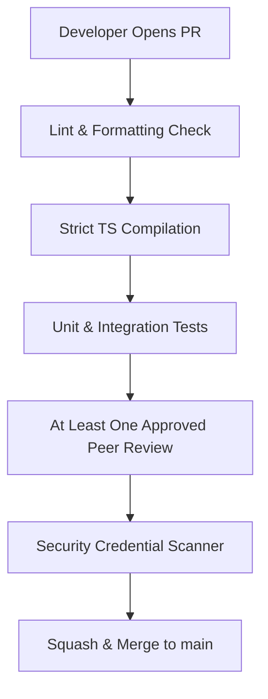

# Development Rules & Coding Standards

This document establishes the code quality mandates, lint configurations, test coverage requirements, and pull request procedures for developers contributing to the **AI Workspace Gateway**.

---

## 🎨 Language & Coding Guidelines

*   **TypeScript-First**: All application logic and integration adapters must be written in TypeScript, using strict typing configurations. The compiler setting `"strict": true` is enforced across all workspace configurations.
*   **Asynchronous-First**: Operations interfacing with disk, network, or IPC borders must use `async/await`. Avoid using synchronous file methods (e.g., `fs.writeFileSync`) as they block the primary Node execution loop.
*   **Zero-State Global Variables**: Modules must not retain mutable global state. State must be encapsulated within singleton managers (e.g., the `SessionManager` class) initialized by the `Gateway Core` lifecycle hooks.

---

## 🛡️ Static Code Quality & Linting

We enforce ESLint and Prettier formatting checks prior to commit authorization.

### 1. ESLint Configuration Rules
*   No implicit `any` assignments (`@typescript-eslint/no-explicit-any`: "error").
*   No unused variables (`@typescript-eslint/no-unused-vars`: ["error", { "argsIgnorePattern": "^_" }]).
*   Floating promises must be handled (`@typescript-eslint/no-floating-promises`: "error").

### 2. Code Formatting (Prettier)
*   **Print Width**: 100 characters.
*   **Tab Width**: 2 spaces.
*   **Semi-colons**: Enabled.
*   **Quotes**: Single quotes preferred, except in JSON configurations.

---

## 🧪 Testing Coverage Requirements

All PRs introducing structural logic additions must include corresponding tests:

*   **Core Modules**: Must maintain $\ge 90\%$ test coverage (statement, branch, function, and line metrics).
*   **Provider Adapters**: Require unit tests using mocked responses. End-to-end integration tests are skipped in standard pull request check loops to prevent API key usage charges.
*   **Database Migrations**: Every new schema change script (e.g., `v2_to_v3.sql`) must feature a corresponding rollback test script verifying data restoration integrity.

---

## 🌿 Pull Request & Review Procedures

To maintain stability on the protected `main` branch, all submissions must pass automated checks.

### Pull Request Constraints
1.  **Commit Alignment**: All commit subject lines must follow the **Conventional Commits** specification (e.g., `fix(core): resolve context window boundary logic`).
2.  **No Unused Files**: Temporary scripts, scratch files, or test DB instances must not be committed to the repository layout. Add temporary files to `.gitignore`.
3.  **Local Checks Hook**: A pre-push Git hook (managed via Husky) automatically executes `pnpm lint` and `pnpm test` locally.
