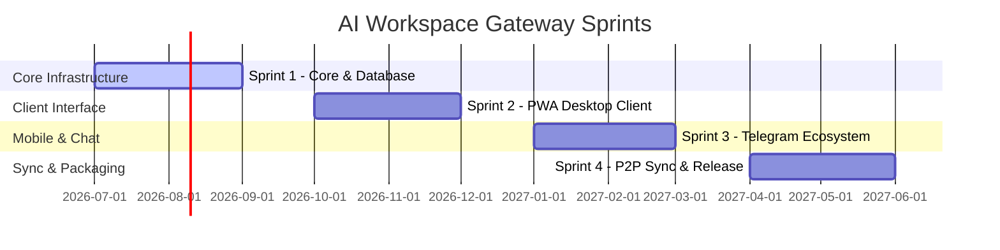

# Implementation Roadmap & Sprint Plan

This document outlines the detailed development sprints, deliverables, testing strategies, and acceptance criteria for building the **AI Workspace Gateway**.

---

## 🗺️ High-Level Implementation Schedule

---

## 🌿 Sprint Breakdowns

### Sprint 1: Core Engine & SQLite WASM Database
*Focus: Establish the backend orchestration and encrypted storage layers.*

#### 🎯 Objectives
*   Initialize packages `core`, `storage`, and `sdk`.
*   Establish database schema matching `DATABASE_SCHEMA.md` with SQLCipher encryption.
*   Implement provider adapters for Gemini and Ollama.
*   Build the primary Event Bus and Execution Controller Reasoning-Action loop.

#### 📦 Deliverables
*   `packages/storage`: Encrypted SQLite adapter, migration scripts, and TouchID/Windows Hello biometrics connector interface.
*   `packages/core`: Event Bus dispatchers, session hydration engines, context windows trimmer, and Task Queue scheduler.
*   `providers/`: Interface adapters translating prompts and streaming completions.

#### ✅ Acceptance Criteria
*   Unit tests prove 100% database recovery compliance after hard crash scenarios.
*   The event loop runs a sample agent step (with mock tool calls) under 5ms event routing overhead.
*   Secrets are verified to reside only in memory and native Keychain stores (no plaintext disk files).

#### 🧪 Testing Strategy
*   **Unit Tests**: Mock LLM responses to isolate the Execution Controller logic. Validate thread trimming operations across varying context bounds.
*   **Integration Tests**: Run local instances of SQLite WASM and verify transaction bounds under concurrent write operations (100 parallel writes).
*   **Security Tests**: Scan compiled memory heaps to verify that decrypted provider API keys are wiped immediately after the request cycle completes.

---

### Sprint 2: PWA Desktop Client & Native OS Bridges
*Focus: Build the Progressive Web App UI and bridge native OS APIs.*

#### 🎯 Objectives
*   Build the responsive frontend layout specified in `UI_SPEC.md`.
*   Establish the REST and WebSocket gateway listeners (`API_PROTOCOL.md`, `EVENT_PROTOCOL.md`).
*   Package the application as a menubar/system tray client using native wrappers.

#### 📦 Deliverables
*   `apps/pwa`: Responsive React/Vite client codebase, service worker files, and UI layout grids.
*   `packages/common`: Shared design tokens (dark/light themes) and vector status indicators.
*   OS Installers: macOS DMG installer plist scripts and Windows WiX installer XML configs.

#### ✅ Acceptance Criteria
*   The application operates completely offline when routed to a local Ollama model.
*   Global system tray shortcuts launch/focus the workspace interface instantly.
*   The PWA loads under 1 second on local server tests (Lighthouse score $\ge 90$ for performance).

#### 🧪 Testing Strategy
*   **End-to-End Tests**: Utilize Playwright to automate user paths (creating workspaces, clearing threads, swapping models, editing configurations).
*   **UI Tests**: Verify grid responsiveness across viewport scales (from 320px mobile up to 4K desktop screens).
*   **OS Tests**: Run installation packages on fresh macOS Sequoia and Windows 11 VMs. Verify system tray context menus and registry run settings.

---

### Sprint 3: Telegram Client Ecosystem
*Focus: Build the remote access bot gateway and Telegram Mini App dashboard.*

#### 🎯 Objectives
*   Expose secure communication tunnels for remote connections (Cloudflare / Tailscale).
*   Build the Telegram Bot gateway handling user command processing.
*   Establish the mobile Telegram Mini App dashboard view.

#### 📦 Deliverables
*   `apps/telegram`: Bot server daemon and Telegram WebApp pages.
*   Tunneling Scripts: Cloudflare Tunnel templates and Tailscale configuration profiles.

#### ✅ Acceptance Criteria
*   Users can switch active workspaces and check task lists via standard chat commands.
*   Mini App biometric unlocks successfully authenticate against local master keys via the Telegram Biometrics API wrapper.
*   Tunnels auto-recover connection state after network drops.

#### 🧪 Testing Strategy
*   **Bot Tests**: Mock Telegram chat payloads to verify inline keyboard routing, command parsing, and markdown output formats.
*   **Network Tests**: Simulate network connection drops (3G down to offline) during streaming completions. Verify client reconnect loops.

---

### Sprint 4: Peer-to-Peer Synchronization & Releases
*Focus: Enable decentralized sync, Linux wrappers, and production tags.*

#### 🎯 Objectives
*   Implement CRDT synchronization algorithms for cross-device updates.
*   Expose Linux packages (Flatpak / AppImage).
*   Establish the automated CI/CD release workflow.

#### 📦 Deliverables
*   Sync Adapters: WebRTC signaling structures and merge logic blocks.
*   Linux Packages: Flatpak build scripts.
*   GitHub Workflows: Final release build and sign actions.

#### ✅ Acceptance Criteria
*   Simultaneous edits on Desktop PWA and Telegram client resolve without message history loss.
*   Release artifacts compile, sign, and publish to GitHub Releases on tag merge.

#### 🧪 Testing Strategy
*   **Conflict Tests**: Simulate network partitions where client A and client B make concurrent edits to the same thread, then synchronize. Verify schema state convergence.
*   **Production Release Dry Runs**: Run CI action runners to verify binary signing signatures and notarization outputs.
