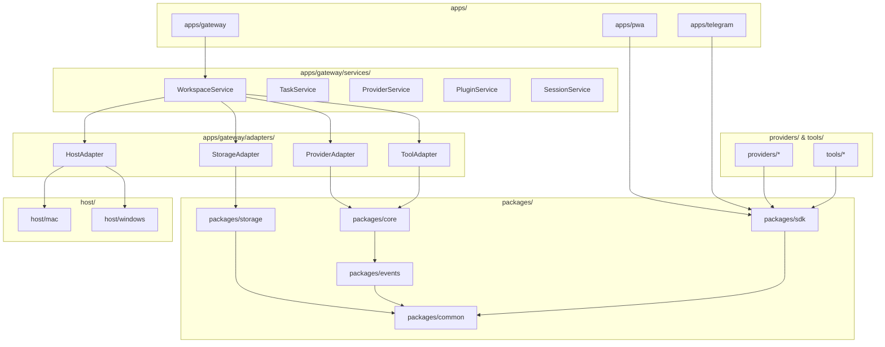

# Dependency Architecture & Graph Rules

This document specifies the strict dependency hierarchy and layer isolation constraints of the **AI Workspace Gateway** codebase. All imports and package structures must conform to these rules.

---

## 🏗️ Layer Hierarchy & Mermaid Graph

The system enforces a unidirectional downward flow of imports:

---

## 🚦 Dependency Rules Matrix

| Source Module | Target Layer | Status | Reason / Constraints |
| :--- | :--- | :--- | :--- |
| **`apps/*`** | **`packages/*`** | **ALLOWED** | Client applications consume shared abstractions and SDK helpers. |
| **`providers/*`** | **`packages/*`** | **ALLOWED** | Provider drivers must import SDK interfaces to satisfy the standard contract. |
| **`tools/*`** | **`packages/*`** | **ALLOWED** | Tools import schemas and validation helpers from shared SDK blocks. |
| **`packages/*`** | **`apps/*`** | 🚫 **FORBIDDEN** | Core libraries must never contain imports from application code (causes circular bounds). |
| **`providers/*`** | **`providers/*`**| 🚫 **FORBIDDEN** | Providers must be isolated. A provider cannot import another provider. |
| **`tools/*`** | **`providers/*`**| 🚫 **FORBIDDEN** | Tools operate independently of the underlying AI model. |
| **`host/*`** | **`providers/*`**| 🚫 **FORBIDDEN** | OS bridge adapters must remain decoupled from specific AI services. |

---

## 🔒 Layer Isolation & Egress Rules

### 1. Gateway Isolation Rules
*   **FastAPI Boundaries**: FastAPI dependencies and routes (`apps/gateway/routers/`) are strictly gateways. They must only map requests, verify tokens, and pass execution control to the corresponding `Service` classes. Under no circumstance should a router write directly to the database or invoke provider APIs.

### 2. Platform Call Restrictions
*   **No Direct Platform Calls**: The Gateway Core and Service layers must never directly call platform-specific OS APIs (e.g., Node's `process.platform`, Win32 DLL calls, or macOS AppleScript bindings).
*   **Bridges Boundary**: Any OS interaction must resolve through the `HostAdapter` which delegates calls to `host/mac/` or `host/windows/` implementation adapters.

### 3. Service vs. Adapter Boundaries
*   **Services** contain core business logic (e.g., checking user quotas, calculating prompt memory, formatting history contexts).
*   **Adapters** contain driver logic only (e.g., executing the specific HTTP request parameters of the Anthropic API, or reading/writing files via a local host handle).
