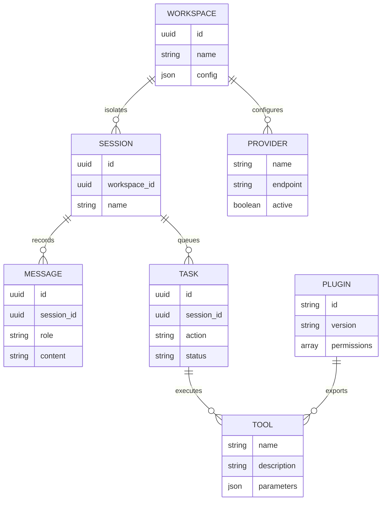
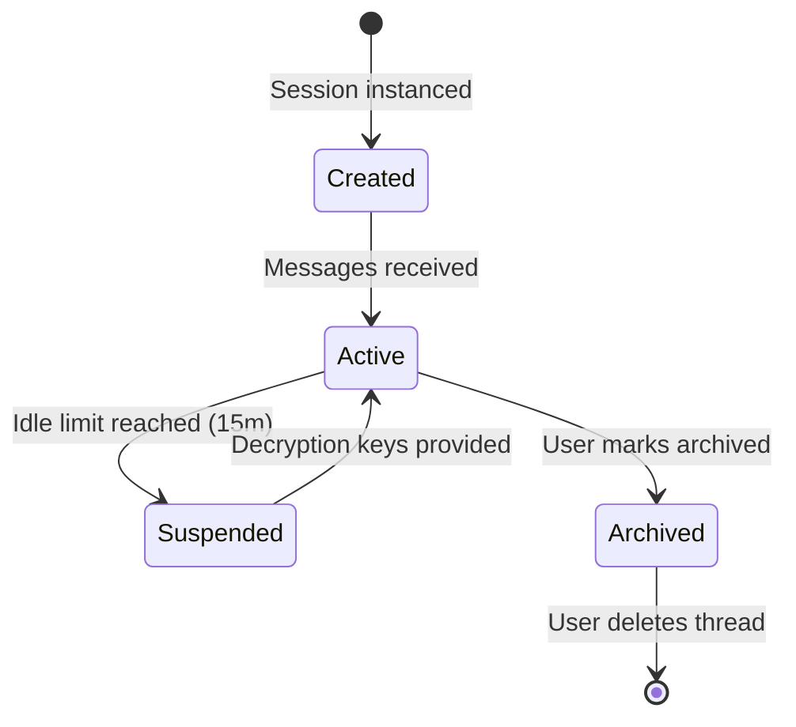
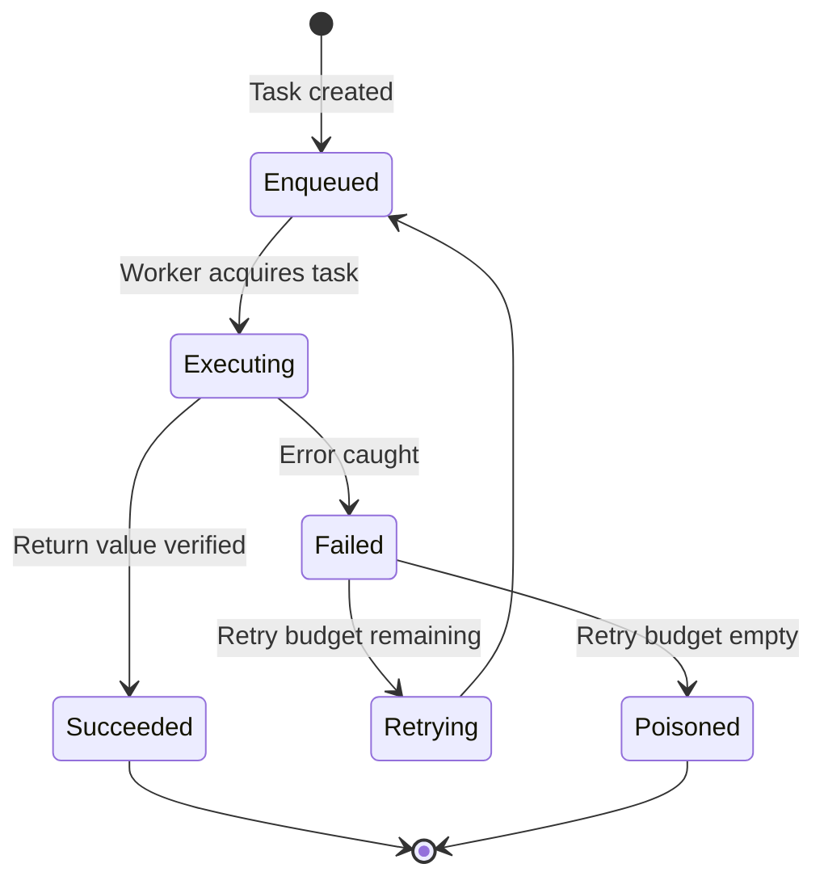

# Domain Model Specification

This document details the core business entities, structural properties, relationships, and state lifecycles of the **AI Workspace Gateway**.

---

## 📊 Entity Relationship Diagram

The core entities of the gateway relate to execution contexts and isolated storage spaces:

---

## 🏷️ Domain Entity Definitions

### 1. Workspace
*   **Definition**: The primary logical isolation boundary. Holds threads, local vector slices, and decrypted model configurations.
*   **Ownership Rules**:
    *   A Workspace owns all its child Sessions, Credentials, and Vector Indices.
    *   Deleting a Workspace triggers a cascade purge of all associated child data.

### 2. Session (Chat Thread)
*   **Definition**: An active conversation log.
*   **Ownership Rules**:
    *   Belongs strictly to a parent Workspace.
    *   Holds a ordered list of Messages and associated Task logs.

### 3. Task
*   **Definition**: A background job payload queued in the Task Queue.
*   **States**: `enqueued` $\to$ `executing` $\to$ `succeeded` / `failed` / `poisoned`.

### 4. Provider
*   **Definition**: An AI model integration endpoint adapter wrapper.
*   **States**: `registered` $\to$ `configured` $\to$ `active` / `inactive`.

### 5. Tool
*   **Definition**: A function interface schema that agents invoke.
*   **Validation**: Every tool must expose a JSON Schema matching the argument types of the tool function.

### 6. Plugin
*   **Definition**: Third-party sandboxed bundle.
*   **Ownership Rules**:
    *   A plugin operates inside a sandbox and can only access the host system if authorized by the Workspace configuration boundaries.

---

## 🔄 Lifecycle Transitions Diagram

### 1. Session Thread Lifecycle
The diagram below details the thread transitions from creation to indexing:

### 2. Task Processing Lifecycle
Tasks transition within the Task Queue scheduler:

