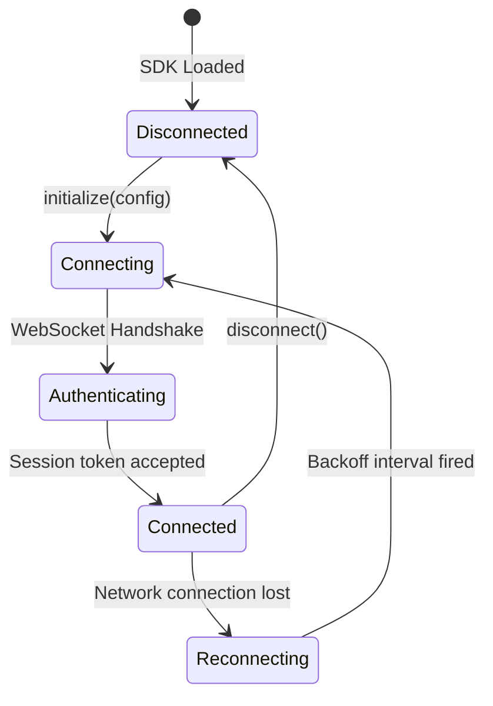

# Client SDK Specification

This document defines the stable client-side software integration contract for building interface applications (such as the Progressive Web App or Telegram Mini App) that connect to the **AI Workspace Gateway**.

---

## ⚡ Client Communication & Lifecycle

The Client SDK manages REST API queries and handles the WebSocket event state machine, providing a resilient reconnect layer.



---

## 🧱 Client SDK Contract (TypeScript SDK Specification)

Any frontend application communicating with the gateway core uses the client contract interfaces specified below.

### 1. Types & Subscriptions

```typescript
export interface ClientConfig {
  endpoint: string;             // HTTP protocol path (e.g., "http://localhost:8080")
  token: string;                // Authorizing token for local endpoint
  autoReconnect?: boolean;      // Re-establish WebSocket automatically
  maxReconnectAttempts?: number; // Reconnect limit (default: 5)
}

export type SubscriptionCallback<T> = (data: T) => void;

export interface TokenChunkPayload {
  sessionId: string;
  taskId: string;
  token: string;
  index: number;
}

export interface ToolStatePayload {
  sessionId: string;
  taskId: string;
  toolName: string;
  state: 'running' | 'completed' | 'failed';
  output?: string;
}

export interface Workspace {
  id: string;
  name: string;
  createdAt: Date;
}

export interface Session {
  id: string;
  workspaceId: string;
  name: string;
  updatedAt: Date;
}

export interface Message {
  id: string;
  role: 'user' | 'assistant' | 'system' | 'tool';
  content: string;
  createdAt: Date;
}
```

### 2. Client SDK Interface

```typescript
export interface WorkspaceSDK {
  // Retrieve list of all workspaces
  list(): Promise<Workspace[]>;
  
  // Create a new isolated workspace
  create(name: string, config?: object): Promise<Workspace>;
  
  // Delete a workspace and purge local records
  delete(workspaceId: string): Promise<boolean>;
}

export interface SessionSDK {
  // List sessions matching workspace constraint
  list(workspaceId: string): Promise<Session[]>;
  
  // Create a chat session thread
  create(workspaceId: string, name: string): Promise<Session>;
  
  // Fetch messages in a thread
  getHistory(sessionId: string): Promise<Message[]>;
  
  // Send a message and initialize execution
  sendMessage(sessionId: string, content: string): Promise<{ taskId: string }>;
}

export interface GatewayClient {
  config: ClientConfig;
  workspaces: WorkspaceSDK;
  sessions: SessionSDK;

  // Lifecycle Methods
  connect(): Promise<void>;
  disconnect(): Promise<void>;
  
  // Event Subscriptions
  onTokenStream(sessionId: string, callback: SubscriptionCallback<TokenChunkPayload>): () => void;
  onToolStateChange(sessionId: string, callback: SubscriptionCallback<ToolStatePayload>): () => void;
  onTaskCompletion(sessionId: string, callback: (taskId: string) => void): () => void;
  onConnectionChange(callback: (status: 'connected' | 'disconnected' | 'connecting') => void): () => void;
}
```

---

## 🔄 Reconnection & Event Buffer Strategy

### 1. Exponential Backoff Workflows
*   If the socket closes unexpectedly:
    *   Attempt 1: Wait 1000ms.
    *   Attempt 2: Wait 2000ms.
    *   Attempt 3: Wait 4000ms.
    *   Attempt $N$: Wait $2^N \times 1000$ milliseconds up to a maximum of 30,000ms.
*   Once reconnected, client issues a sync command containing its last processed message timestamps to hydrate missed event loops.

### 2. Stream Buffer Merging
*   Token chunks are ordered sequentially using the `index` property.
*   The client SDK maintains an in-memory message character array. It orders incoming tokens by `index` before updating UI layers to prevent message text fragmentation during rapid packet transmission.
