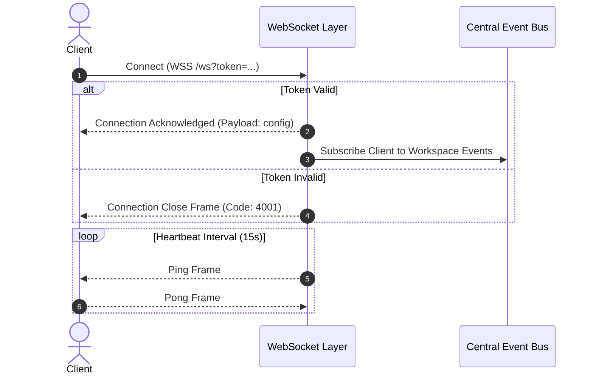

# WebSocket Event Protocol Specification

This document details the real-time event frames, message schemas, and Event Bus topic structures of the **AI Workspace Gateway** WebSocket layer.

---

## 🏗️ Real-Time Connection Flow

Clients establish persistent duplex connections for real-time monitoring and token stream retrieval.



---

## 🧱 Message Frame Structure

Every payload dispatched or received over the WebSocket connection is formatted as a single JSON object.

### General Message Envelope
```json
{
  "event": "string",
  "sessionId": "string",
  "taskId": "string",
  "timestamp": "ISO-8601-string",
  "payload": {}
}
```

---

## 🏷️ WebSocket Event Reference

### 1. Token Stream Output
*   **Event Name**: `session.token.stream`
*   **Payload Schema**:
    ```json
    {
      "token": "analytics",
      "index": 42
    }
    ```

### 2. Tool Execution Updates
*   **Event Name**: `session.tool.state`
*   **Payload Schema**:
    ```json
    {
      "toolName": "file_reader",
      "state": "running",
      "args": { "path": "./src/index.js" }
    }
    ```

### 3. Queue Task Metrics
*   **Event Name**: `session.task.metrics`
*   **Payload Schema**:
    ```json
    {
      "queuePosition": 0,
      "concurrencySlots": 4,
      "state": "executing"
    }
    ```

### 4. System Alerts
*   **Event Name**: `system.alert`
*   **Payload Schema**:
    ```json
    {
      "level": "warning",
      "message": "Host CPU usage exceeds 80%. Secondary indexing tasks paused.",
      "code": "CPU_THRESHOLD_REACHED"
    }
    ```

---

## 🌿 Event Bus Topic Topography

The internal `Event Bus` routes typed event patterns. The table below documents the top-level namespaces:

| Topic Pattern | Description | Triggering Subsystem |
| :--- | :--- | :--- |
| `workspace.*` | Workspace lifecycle events (`workspace.created`, `workspace.deleted`). | Workspace Manager |
| `session.*` | Chat thread operations (`session.created`, `session.cleared`). | Session Manager |
| `agent.*` | Agent cycle phases (`agent.turn.start`, `agent.reasoning`, `agent.done`). | Execution Controller |
| `plugin.*` | Sandbox load lifecycle (`plugin.loaded`, `plugin.terminated`). | Plugin Loader |
| `system.*` | Host monitoring alerts (`system.resource.critical`, `system.shutdown`).| Health Monitoring |

---

## 🚦 Connection Terminations & Close Codes

The gateway uses the following custom WebSocket close codes to indicate execution or authentication failures:

| Close Code | Close Reason | Details / Recovery |
| :--- | :--- | :--- |
| `1000` | Normal Closure | Standard connection termination request. |
| `4001` | Unauthorized | Bearer token validation failed on handshake. |
| `4002` | Workspace Locked | Master database keys not unlocked yet. |
| `4003` | Concurrency Limit | Concurrency limits reached, socket rejected. |
| `4008` | Heartbeat Timeout | Client missed multiple ping/pong checks. |
| `4012` | System Shutdown | Gateway Core shutting down. |
