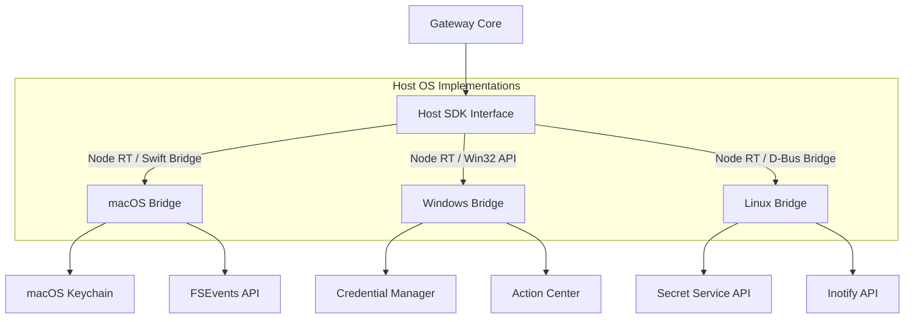

# Host SDK Specification

This document defines the stable, cross-platform interface contract between the **AI Workspace Gateway** core runtime and the host operating system (macOS, Windows, and Linux).

---

## 🏗️ Platform Integration Mapping

The Host SDK exposes a unified TypeScript/native interface while routing execution to the target OS APIs:



---

## 🧱 Host SDK Contract (TypeScript API Specification)

All operating system bridges must implement the following interfaces:

```typescript
export interface FileStats {
  size: number;
  createdAt: Date;
  modifiedAt: Date;
  isDirectory: boolean;
}

export interface SystemUsage {
  cpuUsagePercent: number;
  totalMemoryBytes: number;
  freeMemoryBytes: number;
  processRssBytes: number;
}

export interface SecureStorageAPI {
  // Save credentials securely
  setPassword(service: string, account: string, secret: string): Promise<void>;
  
  // Retrieve credentials securely
  getPassword(service: string, account: string): Promise<string | null>;
  
  // Remove credentials securely
  deletePassword(service: string, account: string): Promise<boolean>;
}

export interface FilesystemAPI {
  // Read local file contents into buffer or string
  readFile(absolutePath: string, options?: { encoding?: string }): Promise<string | ArrayBuffer>;
  
  // Write contents to local file path
  writeFile(absolutePath: string, data: string | ArrayBuffer): Promise<void>;
  
  // Retrieve directory contents
  readDir(absolutePath: string): Promise<string[]>;
  
  // Retrieve file metadata
  stat(absolutePath: string): Promise<FileStats>;
  
  // Watch local directory paths for real-time changes
  watch(
    absolutePath: string, 
    onChange: (event: 'create' | 'update' | 'delete', filePath: string) => void
  ): () => void; // Returns unsubscribe method
}

export interface NotificationAPI {
  // Trigger system notification bubble
  showToast(title: string, body: string, actionUrl?: string): Promise<void>;
  
  // Request user authorization to register notifications
  requestPermissions(): Promise<boolean>;
}

export interface TrayAPI {
  // Initialize or update the system tray icon
  setTrayIcon(iconPath: string): Promise<void>;
  
  // Define context menu items displayed when tray icon is clicked
  setContextMenu(menuItems: Array<{
    label: string;
    type: 'normal' | 'separator' | 'checkbox';
    checked?: boolean;
    onClick?: () => void;
  }>): Promise<void>;
}

export interface SystemAPI {
  // Retrieve system CPU/Memory loads
  getUsageMetrics(): Promise<SystemUsage>;
  
  // Register callback to run before process termination
  onBeforeExit(callback: () => Promise<void>): void;
}

export interface HostBridge {
  platform: 'darwin' | 'win32' | 'linux';
  secureStorage: SecureStorageAPI;
  filesystem: FilesystemAPI;
  notifications: NotificationAPI;
  tray: TrayAPI;
  system: SystemAPI;
}
```

---

## 🔒 Security Constraints & OS Boundary Mapping

The implementation bridges must adhere to the following platform-specific isolation policies:

### 1. File Path Sanitization
*   Adapters must check paths using standard absolute normalization. Under no circumstance should a relative traversal query (`../../`) resolve paths outside the registered workspace directory root.
*   If path violations occur, the Host SDK must throw a `SecurityPathTraversalError` and record the activity within the `AuditLogs` table.

### 2. Biometric Guardrails
*   When accessing `secureStorage.getPassword()` for high-risk keys (e.g., wallet keys or workspace credentials), the implementation must verify with `SystemAPI` to prompt OS biometric prompts if configured.
