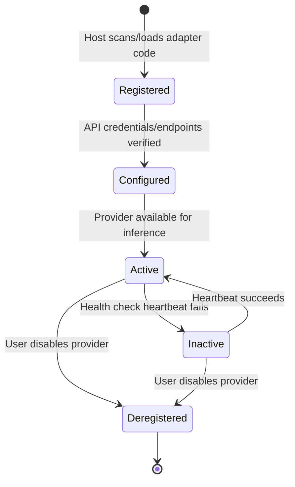

# Provider SDK Specification

This document defines the stable integration contract that all AI model providers (both local runtimes and remote commercial APIs) must implement to interface with the **AI Workspace Gateway**.

---

## 🔄 Provider Lifecycle

Every provider adapter transitions through the following lifecycle states managed by the Provider Manager:



### State Transitions
1.  **`Registered`**: The adapter code is detected and loaded. Metadata is parsed (manifest configuration specs).
2.  **`Configured`**: Decrypted workspace credentials matching the schema are bound. Connections are verified.
3.  **`Active`**: The model registry returns status `healthy` and is ready to receive inference turns.
4.  **`Inactive`**: Network timeout, API credentials revoked, or local model runner is shutdown.

---

## 🧱 Provider SDK Contract (TypeScript/WASM Schema)

All provider integrations must expose the interface contracts defined below. No implementation code is provided.

### 1. Types & Interfaces

```typescript
export interface ModelMetadata {
  id: string;             // Internal ID (e.g., "gemini-1.5-pro")
  displayName: string;    // Human-readable name
  contextWindow: number;  // Max token capacity
  capabilities: {
    text: boolean;        // Chat/text completion
    vision: boolean;      // Multimodal image support
    toolCalling: boolean; // Native function calling support
    embeddings: boolean;  // Vector embeddings support
  };
}

export interface ProviderManifest {
  name: string;           // Provider name (e.g., "ollama", "google")
  configSchema: object;   // JSON Schema of credentials needed (keys, ports)
  getModels(): Promise<ModelMetadata[]>;
}

export interface PromptMessage {
  role: 'system' | 'user' | 'assistant' | 'tool';
  content: string;
  toolCallId?: string;    // Mandatory if role is 'tool'
}

export interface GenerateConfig {
  modelId: string;
  temperature?: number;
  maxTokens?: number;
  stopSequences?: string[];
  tools?: Array<{
    name: string;
    description: string;
    parameters: object; // JSON Schema for arguments
  }>;
}

export interface TokenChunk {
  text: string;
  index: number;
}

export interface GenerateResult {
  content: string;
  toolCalls?: Array<{
    id: string;
    name: string;
    arguments: string; // JSON string parameters
  }>;
  usage: {
    inputTokens: number;
    outputTokens: number;
  };
}

export interface EmbedConfig {
  modelId: string;
  texts: string[];
}

export interface EmbedResult {
  embeddings: number[][]; // Dynamic vector dimensions
}

export interface AIProvider {
  manifest: ProviderManifest;
  
  // Handshake and active status test
  checkHealth(): Promise<boolean>;
  
  // Standard non-streaming generate call
  generate(
    messages: PromptMessage[], 
    config: GenerateConfig
  ): Promise<GenerateResult>;
  
  // Streaming generate call emitting events to the event handler callback
  generateStream(
    messages: PromptMessage[],
    config: GenerateConfig,
    onToken: (chunk: TokenChunk) => void
  ): Promise<GenerateResult>;

  // Vector embeddings generator
  embed(config: EmbedConfig): Promise<EmbedResult>;
}
```

---

## 🚦 Error Handling Specifications

Provider implementations must catch all custom driver exceptions and map them to standard system-level error objects:

| Custom Error Class | HTTP Mapping Code | Cause / Details |
| :--- | :--- | :--- |
| `ProviderAuthError` | `401` | API key invalid, credentials expired, or host permissions rejected. |
| `ProviderRateLimitError` | `429` | Provider quota exceeded, rate limit hit. |
| `ProviderContextOverflowError`| `400` | Input token count exceeds the model's metadata limit. |
| `ProviderTimeoutError` | `504` | Model request timed out (connection issues). |
| `ProviderExecutionError` | `502` | Model backend execution failure (e.g., safety filters triggered, system panic). |

### Standard Error JSON Frame
```json
{
  "error": {
    "code": "PROVIDER_AUTH_ERROR",
    "provider": "openai",
    "message": "Authentication failed: API key invalid.",
    "timestamp": "2026-06-26T18:38:00Z"
  }
}
```
