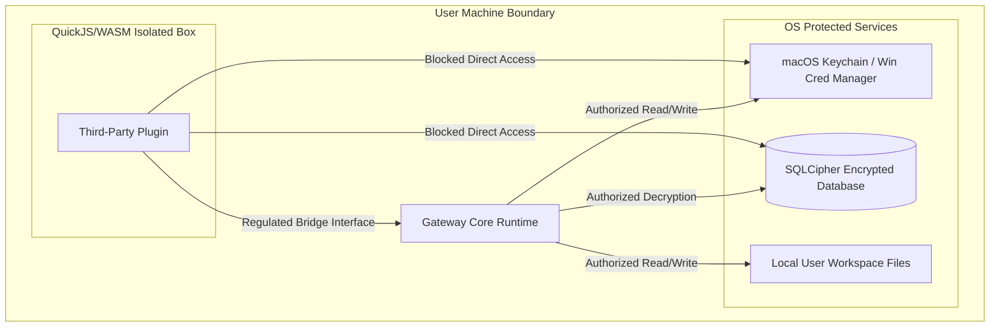

# Security Architecture & Vulnerability Policy

This document details the security model, cryptographic boundaries, credential isolation systems, sandboxing models, and vulnerability reporting procedures of the **AI Workspace Gateway**.

---

## 🛡️ Core Threat Model & Trust Boundaries

The AI Workspace Gateway operates under the assumption that the host workstation is the primary secure boundary. The gateway enforces sandboxing to protect host resources from malicious model generations or compromised third-party plugins.

---

## 🔒 Security Model Specifications

### 1. Database Encryption at Rest
*   **Engine**: Local databases must use SQLCipher or AES-256-GCM record-level encryption wrappers.
*   **Key Derivation**:
    *   The decryption key is derived using **Argon2id** ($m=65536$, $t=3$, $p=4$) or **PBKDF2-HMAC-SHA256** with at least 600,000 iterations.
    *   Decrypted session keys are kept strictly in process memory and are never written to swap space or disk.
*   **Auto-Lock Timer**: If the client is idle for more than 15 minutes, the memory key is purged, closing the database handle until the user unlocks it again.

### 2. Secure Credential Managers
API keys and secrets must not reside in configuration files in plaintext. The Host SDK maps credential storage to native APIs:
*   **macOS**: Uses Apple's Keychain Services API, utilizing security class `kSecClassGenericPassword` with access group rules restricted to our app signature bundle.
*   **Windows**: Uses the Credential Manager API (`CredWriteW` / `CredReadW`) categorized under domain type `AIWorkspaceGateway`.
*   **Linux**: Uses the Secret Service API via D-Bus client bindings.

### 3. Biometric Unlock Integration
*   The gateway leverages biometric challenges before releasing keys from the secure credential manager.
*   **macOS**: Handled through the `LocalAuthentication` framework using `LAContext` with policy `deviceOwnerAuthenticationWithBiometrics`.
*   **Windows**: Handled through the Windows Hello API (`Windows.Security.Credentials.UI.UserConsentVerifier`).

### 4. Plugin Sandbox Isolation
Plugins are executed within a sandboxed runtime (QuickJS compiled to WebAssembly or Node's `vm` module) that restricts all native operating system calls.
*   **Blocked Node Modules**: `fs`, `child_process`, `net`, `http`, `cluster`, `module`, `process`.
*   **Capability Checks**: Plugins must query the Gateway Core Event Bus for resource requests (e.g., file system reads). The event handler prompts the user to grant or deny access for the workspace context.

### 5. Local Network Sandboxing & Egress Domain Allowlisting
*   Local server endpoints (`127.0.0.1`, `localhost`) are monitored by the gateway routing logic. Traffic is blocked unless the target port matches approved configurations (e.g., port `11434` for Ollama).
*   Remote commercial API traffic is limited to a strict egress domain whitelist:
    *   `api.openai.com`
    *   `generativelanguage.googleapis.com`
    *   `api.anthropic.com`
*   Any plugin attempting to establish unauthorized connections will trigger a socket termination and register a warning log in the `AuditLogs` table.

---

## 🐛 Vulnerability Reporting Protocol

**Please do not report security vulnerabilities via public GitHub issues.**

If you discover a security vulnerability in this project, please report it privately via email to [security@ai-workspace-gateway.org](mailto:security@ai-workspace-gateway.org).

### What to Include
To help us investigate and patch the issue as quickly as possible, please include:
1.  A detailed description of the vulnerability and its potential impact.
2.  Clear step-by-step instructions to reproduce the issue (including proof-of-concept scripts or API payloads where applicable).
3.  Details of the client environment where the vulnerability was observed (PWA, Telegram Mini App, macOS, or Windows).

---

## 🕒 Disclosure Timeline & Process

When we receive a valid vulnerability report:
1.  **Acknowledgment**: We will acknowledge receipt of your report within 48 hours.
2.  **Investigation**: We will investigate, verify, and document the vulnerability.
3.  **Remediation**: We will work on a patch and coordinate a release. We aim to resolve and publish a fix within 30 to 90 days from the date of the initial report, depending on the complexity of the patch.
4.  **Public Advisory**: Once the patch is released, we will publish a security advisory on GitHub and attribute the discovery to you (unless you prefer to remain anonymous).
